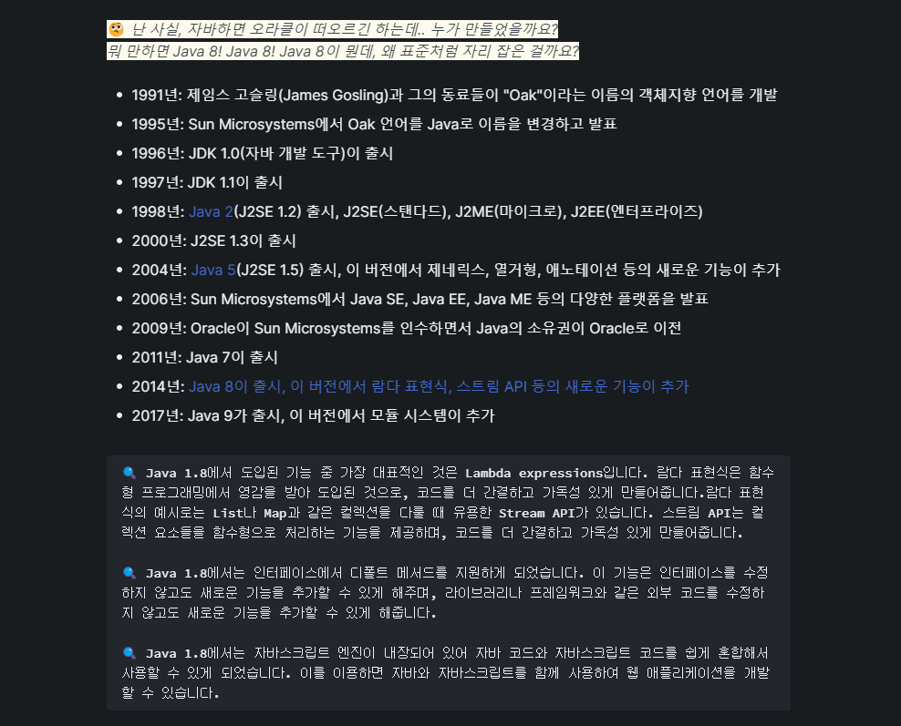

개발 일을 시작하고 드디어 3년차가 되었네요. 서른 넘어 다시 시작한 프로그래밍이었는데, 우려했던 것 보다는 만족스러운 점들이 많아서 잘 지내온 것 같습니다. 몇 년전만해도, 열심히 하다보면 전문성을 갖춰 내가 사용하는 스킬로 무엇이든지 척척 만들어내는 수준이 될거라 생각했는데, 막상 3년차에 접어들어도 매일 부족한 녀석이라고 채찍질하는게 현실이네요 ;(

 

생산적인 측면 혹은 경험도에서 나아진 점이 분명 있다 생각되지만, 요즘 부쩍 걱정과 부담감이 커진 건 사실이에요. 예를들면, 사람들은 나를 함께 일하고 싶은 동료라고 생각할까? 날카로운 의견을 제시할 수 있는 사람인가? 독립적으로 일을 수행하는 능력이 충분한가? 다른 회사의 3년차와의 격차 등..

 

그래서 오늘, 지난 시간을 되돌아보며 잠시 점검하는 시간을 가졌습니다. 회고를 통해, 생각을 정리하고 4년차에는 더더더 만족할 수 있도록 개선점을 도출해보겠습니다.

 
 
 
 

## <strong>`목표 점검 및 개인 회고`</strong> 

먼저 이전 년도에 다짐했던 일들의 아웃풋을 점검해보겠습니다. 사실 이번에 중요하게 생각했던 게, 무리하게 설정해서 이도저도 아니게 실패하지 말자였습니다. 시작할 때는 막 엄청난 포부를 밝히면서 끝에는 자기 합리화하여 실패를 포장하는 모습을 보이기 싫었습니다. 그래서, 심플하게 목표를 잡되 코어적인 측면을 보강할 수 있는 요소들로 채울 수 있었습니다.

 

<strong>개발</strong> 

- 문서 습관화
- 프로그래머스 5000등
- ios 개발 공부(+ 프로젝트)

 

<strong>부가적 요소</strong> 

- 금연
- 체력 단련(체중증가)
- 스피킹 연습

 
 
 
 

## <strong>`문서화를 하는 이유?`</strong> 

<strong>첫 번째</strong>로 짚고 넘어가고 싶은 것은 문서의 습관화입니다. 딴건 몰라도 노트만큼은 열심히하자는 마인드로 신경썼던 것 같아요. 그 이유가, 업무시간과 개인시간에 습득하는 정보가 기억할 수 업을 정도로 방대하더라구요. 순간 기억이 나지 않더라도 명확한 정보를 즉시 제공하고 싶었습니다. 무엇보다 시간과 노력을 절약할 수 있어 워라벨이 좋아 질거라 확신 했습니다. :)

 

- 질문 형식으로 작성
- 같은 내용이라도, 더 좋은 설명으로

 

어떻게 하면 더 기억에 오래 남을지에 대해서 계속 고민한 결과, 질문 형식으로 문서를 구성하기 시작했어요. 마치 초등학생 처럼, 꼬리를 계속 무는 방식으로 스스로 질문하고 대답을 찾아 업데이트 했습니다.

 

하나를 알더라도 내용이 더 깊어지고 오래 기억할 수 있다는 것은 큰 장점이었습니다. 하지만, 굳이 알지 않아도 되는 내용을 담고 있어서 시간 소비가 크다는 게 단점이네요. 그래서 더 잘 이해되는 내용으로 업데이트해서 항상 최적화합니다. 그러면 복습할 때, 핵심만 머리에 쏙! 더 많은 내용을 커버할 수 있더라구요 :)

 

현재, 배운 내용을 [깃북](https://app.gitbook.com/s/FpfkHPFJB4qWsxjvj36q/)에 작성하고 있습니다. 노션, 블로그에 해당 내용을 정리하는 방법도 있겠지만, 가볍고 문서화에 특화된 심플한 UI, 깃헙과 쉽게 연동되는 점이 저에게는 큰 메리트였습니다. 최근에는 알고리즘 문제를 풀이하거나, 블로그 포스팅을 하거나, 이렇게 공부내용을 정리할 때마다, 모든 행동에 자동으로 잔디가 심어지게 해놓았더니, "어 오늘 커밋했나?" 걱정할 필요가 없어졌어요!

 

이번에 자바를 공부하고 문서를 만들면서 느낀점은,  
대부분의 내용이 너무 개념에만 치중한 것 같아 아쉬웠습니다. 생각해보면 누가 나한테 설명을 해줄 때, 그림이나 예시 코드로 표현하는게 더 이해가 잘 되었던 것 같아요. 깊이도 물론 중요하지만, 내용이 많이 지면 루즈해 질 수 있으니 최대한 글을 줄이고 시각적인 자료 또는 예시 코드를 넣어 잘 읽히는 자료를 만들어야겠습니다.

 
 
 
 

## <strong>`알고리즘과 친해질 수 있을까?`</strong> 

알고리즘 문제를 꾸준히 푸는게 중요한 걸 알면서도 잘 안되더라구요. 어떤 문제는 하루, 일주일이 걸리기도 하니까, 결과에서 오는 성취감 보다 과정에서의 피로감이 더 컷달까요? 하루는 동료 개발자가 프로그래머스에서 70문제 정도 푸니까 5000등 정도 된다고 하더라구요. "어 그래? 나도 못할거 없지"라며, 경쟁 의식에 불타서 목표를 등수로 설정했습니다. 현재 약 55문제/38390등, 부끄럽습니다..

 

핑계를 대자면, 이러한 문제 풀이가 실무에 도움이 되는 건 사실이지만 프로젝트에 투입되면 더 큰 고민과 문제들을 충분히 마주치기도하고 본질적으로 문제 해결력을 기르기 위한 것이기에 나중에는 등수보다 꾸준히 하는 것에 의미를 두고 했던 것 같아요.

 

반대로 평소에 많은 구현 문제를 커버했다면, 프로젝트가 더 빠르게 진행될 수 있는 것 아닌가? (또 시작이다, 합리화도 병인 듯) 목표 등수를 채우지 못했다는 것이 아니라, 자꾸만 피한다는 느낌이 강한 것 같아서 찝찝합니다. 이래서 회고를 하나봐요. 후회와 반성을 통해서 성장하라고..

 

어떻게 하면 좋을 까요? 당장 생각나는 건 요즘 백엔드 직책을 맡아 프로젝트를 진행하고 있는데 아직은 자바 언어에 익숙치 않아 고생하고 있어요. 프로그래밍할 때 필요한 메소드, 문법에 적응과 함께 문제해결력을 기르면 좋을 것 같다는 생각이 들어 자바스크립트에서 자바로 언어를 변경했습니다.

 

- Programmers
- LeetCode

 

그리고 내가 자주 볼 수 있는 공간에 풀이를 정리해놓고 자주 노출되게끔하여 복습하도록 LeetCode와 Github를 연동 했습니다. 프로그래머스만 이용해도 충분하지만, 릿코드는 커뮤니티도 훨씬 거대하며, 조금 더 실제 코딩 인터뷰와 유사한 경험을 제공하여 프로그래머스보다 만족도가 높았습니다. 영어 공부는 덤 :)

 

 

정말 신기한게, 알고리즘 문제풀이를 대표 레포지토리로 설정하니까 주기적으로 풀게되는 효과가 정말 있습니다. 누군가에게 내 코딩실력을 보여준다고 생각하니까, 하나라도 더 풀게 되네요. 목표 달성은 실패했지만, 천천히 꾸준히 문제를 담아서 알고리즘과 친해져 볼게요. 안되면 또 다른 방법을 찾아냅시다!

 
 
 
 

## <strong>`스택 오버 플로우에 대한 생각`</strong> 

iOS에 관심이 있어 스위프트, 스위프트UI를 공부했습니다. 개발자로서, 내가 가장 많이 쓰는 애플 제품에 대해서 남들보다 많이 알고 싶었습니다. 또한 이전에 증강현실 웹 앱을 만들면서 Apple의 Reality kit, AR kit라는 신세계를 경험하고 이 기술을 비교해보고 싶은 욕구가 컸어요.

 

스위프트를 공부하면서 마찬가지로 [깃북](https://undefined-343.gitbook.io/ios-docs/)에 정리했고, 내가 런칭 해보고 싶은 모바일 프로젝트(stim)를 동시에 진행했습니다. Zero to One, 기획 - 디자인 - 설계 단계를 거쳐 UI를 구현하는 것까지 모바일로 해보면서 이전에 알지 못했던 도메인 지식, 프로젝트 관리 능력을 키워낼 수 있었습니다.

 

해당 프로젝트는 현재 웹앱으로 전환하고 있습니다. 아무래도 단일 네이티브앱 개발했을 경우에 나중에 비용이 걱정되기도 했고, 핵심 기능 구현 및 유지보수에 있어 전체적으로 관리가 편한 스택으로 전환하기 위함입니다. 배포 및 심사에 있어 유리한 점이 매우 큰 것이 가장 큰 이유였던 것 같아요.

 

 

앱 설계도를 직접 작성해봤습니다.  
그림을 보니, 정말 많은 것들을 할 수 있게 된것에 뿌듯하지만, 그것도 잠시 생각에 잠깁니다.

 

- 3년차 주제에 이걸 다 할거라고?
- 프론트 엔드 개발자로서는 전문성이 너무 떨어지는 거 아닌가?

 

저는 스타트업, SI 업체에서 일을 했기때문에, 최대한 요구사항에 맞게 일을 해야합니다. 업무의 특성상 때로는 하기 싫은 일도 해내야 하는 경우가 빈번하지요 ㅎ. 대기업의 경우 업무가 세분화 되어 있어서 이 부분에서는 유리할 수도 있습니다. (현실은 다 잘함)

 

누군가는 "헬로월드만 해봤네"라고 생각할 수도 있어요. 저 또한 최근까지 커리어가 꼬이는 게 아닌가라고 생각했습니다. 근데 내가 개발자가 되려 했던 이유를 되새겨 보면, 좋은 프론트엔드 개발자되는 것이 아니라 사람들에게 깊이 스며든 서비스를 만드는 개발자입니다.

 

좋은 동료도 되고 싶고, 리더도 되고 싶습니다. 비록 지금 헬로월드면 어때요, 프론트엔드만 할 때보다 더 큰 크림을 볼 수 있게 되었습니다. 프론트엔드 개발 실력은 정체 되었을지언정, iOS 공부를 함으로서, 더 넓은 사고와 좋은 마음 가짐을 가지게 되었습니다. 혹시 모르죠, 100만 사용자를 가진 훌륭한 앱이 탄생할지도 :)

 
 
 
 

## <strong>`올해 최대의 업적, 금연`</strong> 

몇 개월 전만해도 하루 담배 한갑, 운동도 안하고 찌들어 있었는데 많이 달라진 걸 체감하고 있습니다. 지금도 물론 겉모습은 크게 달라진건 없지만 ㅎㅎ.

 

이 일을 오래 꾸준히 하기 위해, 정말 불가능할 것만 같은 일들을 목표로 삼았는데 다행히 현재 시점에서 금연과 체중 증가가 잘 유지되고 있습니다. 평생 마른 몸으로 살았는데, 앞으로 6개월 정도만 더 열심히하면 표준 체중에 충분히 도달할 수 있을 것 같구, 금연은.. 남들 다하는 건데요 모 ㅎㅎㅎ. 길게 쓰지 않겠습니다.(제일 뿌듯)

 
 
 
 

## <strong>`넥스트 스텝`</strong> 

만족스러운데 만족스럽지 않아요. ㅎㅎㅎ. 항상 느끼는 거지만, 계획의 시작과 끝의 기분이 달라요. 그래도 회고를 진행하면서 문제점들을 해결하기 위해 깊은 생각에 빠지기도 했고 유의미한 결과도 얻었다는 걸 알 수 있는 시간이었네요.

 

개인 회고와 프로젝트 회고를 모두 작성할 예정이었지만, 글이 너무 늘어지는 것 같아 프로젝트 회고는 다음으로 넘기겠습니다. 회고가 그저 일기처럼, 했던일들을 나열하기만 한다면 큰 의미가 없을 것 같아요. 추가적으로 보완하면 좋을 점, 다음 목표를 적절하게 채우는 것을 마지막으로 글을 끝내겠습니다.

 

<strong>이전 목표의 보완점</strong>

- 문서화를 할때, 어려운 내용을 다룰 때 개념을 늘어놓기보다 베스트 예시 코드로 구성하는게 훨씬 더 도움이 되었던 것 같음, 복습 때 과감히 레거시를 정리
- 코딩 테스트에 불가능한 목표 설정 x, 재미와 흥미가 우선이므로 베이직한 문제들을 자주 풀고, 자바 숙달 및 적절한 자료구조의 사용에 집중
- 회사 프로젝트 후, 조금 더 깊이감 있는 개념을 숙지해야겠다고 느낌, CS 스터디 참가
- 더 견고한 앱, 실제 런칭을 위한 과정을 경험해보고 싶음, 프로젝트 팀원 구성

 

<strong>새로운 목표</strong>  

- 스프링 / 스프링부트 공부
- 독서(오브젝트, 헤드퍼스트 디자인패턴)
- AWS 자격증 공부

 
 
 
 
