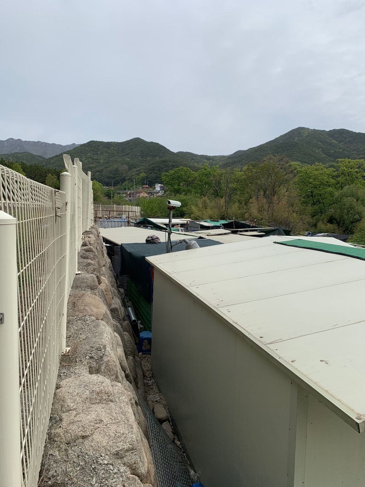

오늘은 제 일상에 대한 이야기를 기록해보려해요. 직업 때문이라 그런지 매일 컴퓨터만 잡고 있어요. 주말에는 쉬면서 리프레쉬 해야지 다짐하면서도 그게 잘 안되네요. 뭘 하자고 해도, I 성향이라서 난 집에만 있는게 좋아라는 말을 몇 년째 인지 ㅎㅎ(그래도 좋음)

 

정말 가끔은 혼자서 활동적인 걸 하고 싶은데 이번이 그런 날이었던 것 같아요. 사실, 날씨가 너무 화창해서 그런지 노트북을 확 반대로 접어버리고 싶더라구요. 그래서 이왕 나가서 뭘 한다면 조금 의미있는 일을 하고 싶어서 찾아보다가, 지난 일요일에 유기견 봉사활동에 참여하고 왔어요 :)

 
 
 
 

## <strong>`참여 계기`</strong> 

한나네 보호소는 팔공산 중턱에 위치하고 있는 유기견들을 보호하고 있는 시설입니다. 이 날은 정말 날씨가 좋아서, 정말 많은 자원봉사자들이 참여했는데요. 저는 해파리 1호점이라는 소속으로 참여하였습니다. 해파리 1호점이라는 모임은 대구에서 여러가지 취미 활동을 할 수 있는 다양한 행사들을 제공합니다.

 

지금까지 가입만하구 한번도 참여한 적 없었지만, 이번에 대구에서 유명한 봉사단체는 또바기와 함께 콜라보한다고해서 바로 참여 신청했어요. 초면이었는데 또바기 단장님이 너무 착하시구 잘 챙겨주셔서 모임을 이참에 바ㄲ...

 

 

아침 9시에 차로 출발했고 대구에서 약 35분 정도 거리에 위치했습니다. 날씨가 선선하기 봉사하기 딱 좋은 날씨였어요. 사진은 우중충해보이는데, 봉사하기에는 이런 날씨가 좋은 듯 :) 위치는 공개적으로 알려서는 안된다고 해서 관심있으신 분들은 한나네 보호소를 검색하고 보호단체에 가입하시면 될 것 같습니다.

 

규모가 생각했던 것 보다 상당해서 많이 놀랐습니다. (사진 속에 지붕 위 강아지 한마리 있슴 ㅎ)

 

 
 
 
 

## <strong>`봉사에서 하는 일`</strong> 

그때 마다 소장님께서 일을 배분해주시는 것 같았어요. 달력에 스케줄이 적혀있을 정도로 많은 단체가 참여하고 일이 배분되었습니다. 제가 참여한 날의 일정에서 했던 일은 다음과 같아요.

- 분리 수거
- 배설물 정리
- 사료 포대, 물 옴기기
- 집 청소 및 보온 장비 설치
- 간식 주기

 

생각보다 하는 일이 많은 것 같은데, 이 날 저희 뿐만 아니라 다른 단체도 참여했기때문에 일이 빠르게 진행되었던 것 같아요. 남성분들은 대부분 힘쓰는 일을 담당했고 여성분들은 꼼꼼하게 처리할 수 있는 일들을 나눠 했습니다. 그래도 오전 10시에 시작해서 오후 1시 넘어서 끝났네요.

 

 

아 사진 찍는거 싫어서 피해다녔는데... 어쩔 수 없이 정면에서 찍혀버렸네요. (뿌듯)

 

 

일이 어느정도 마무리 되고는 간식도 나눠줬어요. 또바기 단장님께서 직접 가져오신 물품이었는데, 정말 봉사를 좋아해서 하시는게 느껴졌어요. 어릴 때는, 정기적으로 여러 봉사 활동을 많이 다녔는데, 이 분의 모습을 보니 반성도 되구, 옛날 생각도 많이 나서 더 힘내서 할 수 있었던 것 같아요.

 

 
 
 
 

## <strong>`보! 호! 견! 조! 심!`</strong> 

주의 사항을 한가지 말씀드리자면, 강아지를 함부로 만지면 물릴 수 있습니다. 사람에게 큰 상처를 가진 보호견들도 있기 때문에 감정을 공유하지 않은채, 초면에 가까이 하시면 위험합니다. 특히 간식을 줄 때, 상당히 예민해져 손을 입으로 갖다 대는 행위는 하지마셔요. 실제로 이날 여성분 한분이 피봤어요. 조심 또 조심

 

 

마지막 단체 사진, 이날 끝나고 밥도 먹구 커피도 마셨습니다. 추가적인 벙개도 더 할 사람은 했었는데, 저는 방전되서 패스! ㅎㅎ (낯가려서..)

 

 

마지막에 또바기x해파리1호점 콜라보라구 또바기 단장님께서 선물을 다 준비해오셨더라구요. 상품은 랜덤이라고 그랬는데 속으로 고양이 걸려라 제발이라고 주문 검 ㅋㅋㅋ. 너무 감사했고 이런 작은 부분까지 신경쓰시는 모습덕분에 오늘 하루 정말 보람차고, 뿌듯한 하루를 보낼 수 있었던 것 같습니다.

 

봉사에 참여하시는 분들이라 그런지 다들 기본적으로 착하구, 외모도 어찌나 출중하시던지 다 가졌어 정말루, 만약 여러 종류의 자원 봉사를 고민하고 계신분이 계시면 입문하기에 정말 좋은 기회인 것 같아요. 부담스럽지 않고 편한 분위기라 걱정할 게 없습니다 ㅎㅎ.

 

 

 

(회사 책상에 인형이 왜케 많누, 동료들이보면 나이먹은 오타쿠로 볼듯.. 다 선물 받은 건데!)  
다음에는 어르신들을 위한 나눔 봉사에 참여할 것 같아요. 시간이 나면 관련 정보를 포스팅해서 공유하겠습니다. 감사합니다.
