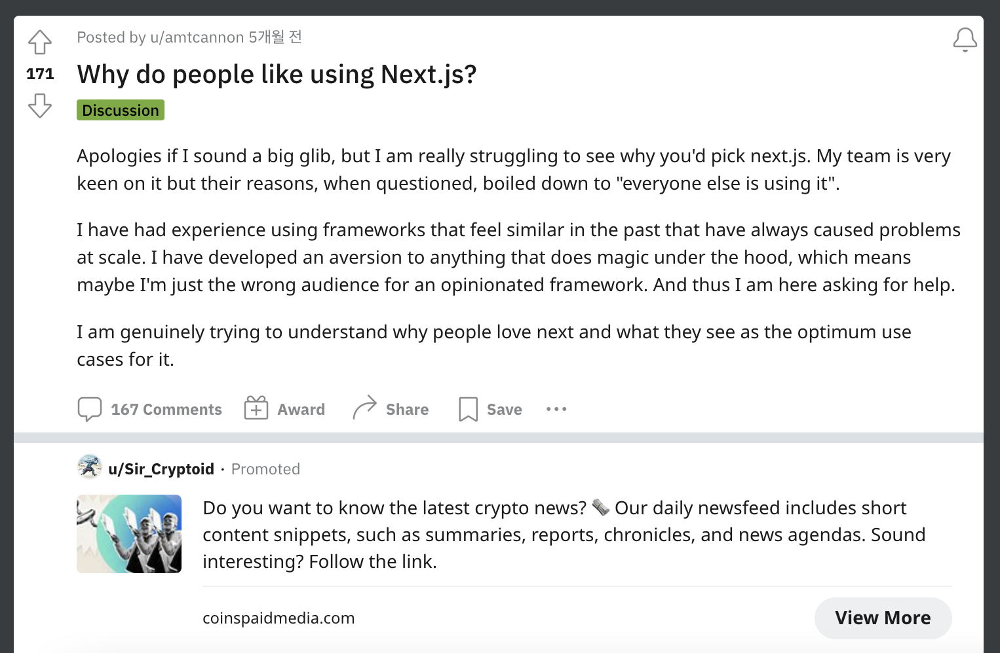
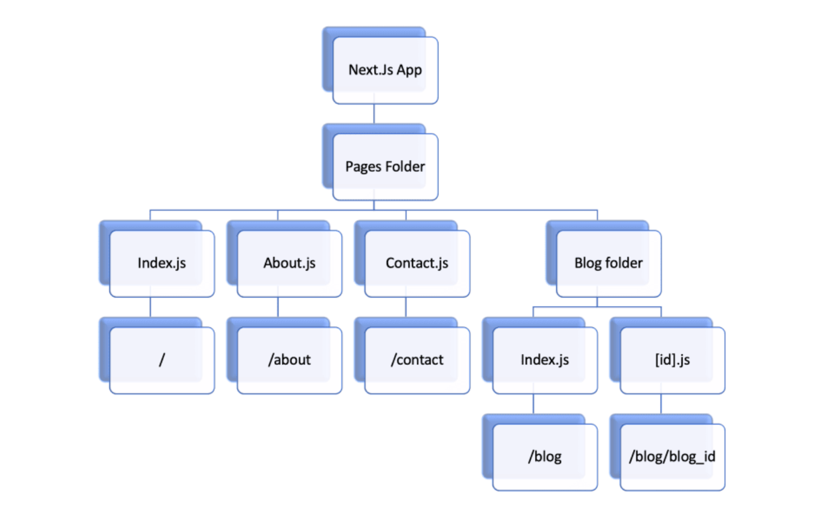
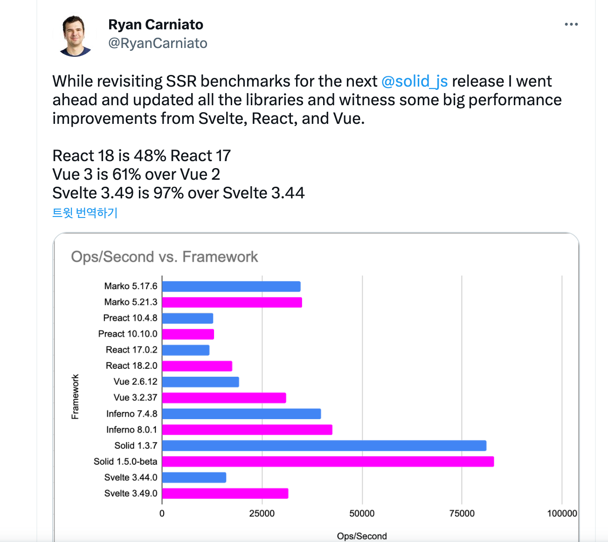

Next.js 프레임워크는 1년 전, 노마드 코더의 니꼴라스 형님의 영상에서 처음 알게 되었습니다. 리액트에서는 상당량의 코드를 작성해야했던 일들을 넥스트에서 간단하게 처리할 수 있어서 당시에 거의, chat-GPT급 반응으로 사람들한테 좋다고 소문내고 다녔는데.. 그닥 큰 반응이 없어서 슬퍼했던 적이 있어요 ;(
</br>
</br>



</br>
</br>

지금 생각해보면 넥스트가 무엇인지는 말할 수 있었지만, 왜 사용하는지에 대해서는 설명을 못했기 때문인 것 같아요. 만약 누가 왜 넥스트를 써야하냐구 물으면, 이제는 그 이유에 대해서 명확하게 대답할 수 있어야겠다고 생각했습니다. 그래서 정리해보았습니다. 리액트보다 나은 점은 뭔지, 왜 넥스트가 특별한지 그리고 유의해야할 점은 무엇이 있는지에 대해서요.

</br>
</br>
</br>
</br>

## <strong>`Why Next.js?`</strong><br/>

넥스트는 풀스택 개발이 가능한 리액트 기반의 프레임워크입니다. 단순히 화면만 그리는 것이 아니라, api를 찍어 낼수도 있고 DB에 접근하여 데이터를 조작할 수 있습니다. 단편적으로 이해하면 뭔가 All in One 같은 느낌을 받지만, 위의 내용은 사실 강력한 기능 중에 하나 일뿐, 굳이 좋은 백엔드 시스템을 굳이? 넥스트로 대체할 필요는 없습니다. Nest.js(node), Spring Boot(java)라는 강력한 서버 사이드 프레임워크가 있으니까요.

</br>

그렇다면 왜 넥스트를 사용해야할까요? 유튜브에 나오는 사람들이 좋다고 하니까? 빅테크 기업의 우대사항에 적혀 있으니까? 최적화?, SSR?, Routing? 물론 이러한 기능이 넥스트를 강력하게 만드는 것은 사실이지만 본질적으로 IoC있다고 생각합니다.

</br>
</br>


</br>
</br>

IoC는 제어의 역전이라고도 불리며, 소프트웨어 개발에서의 디자인 패턴 중 하나입니다. IoC를 적용하면 객체의 생성과 의존성 관리를 외부에서 담당하게 됩니다. 먼 역전 할매 같은 소리냐?(뿌듯) 이걸 쉽게 설명하면, 대규모 어플리케이션을 개발한다고 생각해보세요. 리액트의 경우에, react-router 설치해서 라우팅 하나하나 다 설정해야하고 과거에 server side rendering 하려면, node셋팅해서 요청마다 컴포넌트에 직접 데이터 주입을 처리하는 로직을 구현했어야합니다. 소규모라면 큰 문제가 되지않겠지만, 규모가 커지면 사소한 구현에 하나하나 신경쓰는 것이 여간 귀찮은 일이 아닐 수 없겟쬬. webpack을 잘못건드리는 순간에는..

</br>
</br>


</br>
</br>

하지만, 넥스트에서는 pages 폴더 내의 파일들이 컴포넌트로 사용되며, 라우팅 또는 이들 컴포넌트 간의 의존성을 처리하기 위해 IoC 개념이 활용됩니다. 서버 사이드 렌더링의 경우, getInitialProps 메서드를 통해 컴포넌트가 필요로 하는 데이터를 외부에서 주입하여 초기 렌더링 시 데이터를 미리 가져올 수 있습니다. 이를 통해 서버 사이드에서 데이터를 불러와 컴포넌트에 주입함으로써 초기 렌더링 시 데이터가 준비되어 사용자에게 보다 빠른 화면 표시를 제공합니다.

</br>

원래라면 프로그래머가 모든일을 다 해야했지만, 프레임워크에게 개발자가 처리해야할 일을 역임시키고 개발자는 비지니스로직에만 집중하는 것 제어의 주체가 역전되었음을 의미합니다. 이게 프레임워크의 핵심 역할이고 리액트보다 유연하고, 재사용성이 높아진다는 점! 이것이 바로 넥스트를 사용해야하는 가장 큰 이유라고 생각합니다. 정말 유명한 말이 있죠. "내가 할 수 있다고 해서 내가 해야하는 것은 아니다"


</br>
</br>
</br>
</br>

## <strong>`Performance (vs React)`</strong><br/>

좀 더 구체적으로 대답하려면, 기능과 특징에 대한 올바른 이해가 뒷바침 되어야할 것 같아요. 지금부터는 Next.js의 핵심 내용을 살펴보겠습니다. 단순히 정의만 말하는 것이 아닌 최대한 실제 사례 또는 예시코드를 가지고 성능적인 이점을 다뤄볼게요!

</br>
</br>

<strong>Server Side Rendering</strong></br></br>
먼저, 서버 사이드 렌더링은 간단히 말하면 완성된 HTML문서를 서버로부터 받는 것을 말합니다. 서버에서 필요한 데이터를 다 주입하고 요청에 의해 렌더링된 문서를 받습니다. 딱 두가지만 기억합시다. CSR방식에 비해 검색 엔진 최적화(SEO)와 초기로딩 속도에서 상당한 이점을 가진다는 거!

</br>

Q. 잉?, 아니 렌더링되는 건 똑같지 않나요? 왜 SSR이 더 빠르나요?</br>
A. SSR이 초기 로딩 속도가 더 빠른 이유는 CSR과 SSR의 작동방식에 기인합니다.

</br>

CSR은 브라우저에서 JavaScript를 사용하여 화면을 렌더링하기 때문에, 서버에서 HTML, CSS 및 JavaScript 파일을 다운로드하고 브라우저에서 실행해야 해요. 이는 초기 로딩 속도를 느리게 만들 수 있습니다. 반면에 SSR은 서버에서 HTML 마크업이 완료된 페이지를 클라이언트에게 전달하므로, 브라우저는 전체 페이지를 다운로드하기 위해 추가 요청을 보내지 않아도 됩니다. 또한 SSR을 사용하면 서버 측에서 페이지의 초기 상태를 미리 렌더링할 수 있으므로, 페이지가 완전히 로드되기 전에 사용자가 볼 수 있는 콘텐츠를 더 빠르게 표시할 수 있습니다. 즉, 네트워크 지연 최소화로 초기 로딩 속도를 향상시키는 데에 큰 장점이 있습니다.

</br>
</br>


</br>
</br>

SSR을 사용하여 성능을 향상시키는 실제 사례 중 하나는 트위터입니다. 트위터는 SSR을 통해 초기 로딩 속도를 개선하고 사용자 경험을 향상시키는 데 많은 이점을 얻고 있습니다. 트위터의 SSR 구현은 서버에서 사용자의 타임라인, 트윗, 알림 등의 데이터를 미리 가져와 렌더링한 후 클라이언트에게 전송합니다. 이렇게 하면 클라이언트 측에서는 초기 페이지 로딩 시 서버로부터 받은 HTML을 빠르게 표시할 수 있으며, 사용자는 빈 화면이 표시되는 대기 시간을 최소화할 수 있습니다.

</br>

또한, 트위터의 SSR은 SEO에도 도움이 됩니다. 검색 엔진은 서버에서 생성된 HTML을 쉽게 인식하고 색인하기 때문에 트위터의 콘텐츠가 더 잘 노출될 수 있습니다. 이는 트위터 사용자의 트윗이 검색 결과에 노출되어 더 많은 사람들에게 도달할 수 있는 장점을 제공합니다. SSR을 적용한 트위터의 경우, 초기 로딩 속도 개선과 SEO 강화를 통해 사용자 경험을 향상시키고 더 많은 사용자를 유치하는 데 성공하였습니다. 트위터의 SSR 구현 방법, 성능 향상을 위한 최적화 기법, 서버와 클라이언트 간의 역할 분담 등에 대해 기술 블로그에서 다루고 있으니, 좀 더 깊은 내용을 알기 원하신다면 아래의 링크를 참고해주셔요.

</br>

- [Twitter.com의 성능 개선](https://blog.twitter.com/engineering/en_us/topics/infrastructure/2021/improving-performance-on-twitter-com.html)
- [성능 최적화: 클라이언트 사이드 렌더링과 서버 사이드 렌더링](https://blog.twitter.com/engineering/en_us/topics/infrastructure/2021/optimizing-for-performance-client-side-rendering-and-server-side-rendering.html)

</br>
</br>
</br>

<strong>Hybrid Routing</strong></br></br>
다음은 넥스트의 라우팅 시스템입니다. Next.js는 파일 시스템 기반의 라우팅을 지원하여 페이지와 경로를 매핑합니다. 개발자는 별도의 라우팅 설정 없이 페이지와 경로를 간편하게 매핑하고 다양한 라우팅 시나리오를 구현할 수 있습니다.

</br>
</br>



</br>
</br>

1. 프로젝트의 "pages" 디렉토리에 있는 파일들이 각각의 경로와 매핑됩니다. 예를 들어, "pages/index.js" 파일은 "/" 경로와 매핑되고, "pages/about.js" 파일은 "/about" 경로와 매핑됩니다.

2. 동적 라우팅을 지원하여 경로의 일부를 매개변수로 사용할 수 있습니다. 예를 들어, "pages/users/[id].js" 파일은 "/users/1", "/users/2"와 같은 경로에 대해 매개변수로 "id"를 사용하여 동적으로 처리할 수 있습니다.

3. "next/link" 모듈을 제공하여 내부적으로 "a" 태그를 사용한 클라이언트 사이드 라우팅을 지원합니다. 이를 통해 페이지 간의 링크를 쉽게 구성하고 클라이언트 사이드에서 페이지 이동을 처리할 수 있습니다.

4. "pages/api" 디렉토리를 통해 API 엔드포인트를 구성할 수도 있습니다. 이를 통해 서버사이드에서 데이터를 가져오거나 처리하는 데 사용할 수 있는 간단한 API를 구축할 수 있습니다.

</br>

개인적으로 가장 만족스러웠던 부분은 라우팅을 위해 더 이상 React-Router와 같은 라이브러리는 필요없다는 점, Next.js의 내장 라우팅 시스템만으로 충분히 기능적인 라우팅을 구현할 수 있다는 것입니다. 사용해보면 알겠지만, 페이지와 URL 경로 간의 일관성을 유지할 수 있기때문에 생산성이 정말 높아지고 실수가 확연히 줄어듭니다.

</br>
</br>
</br>

<strong>Pre-built optimizations</strong></br></br>
넥스트는 빌드 시 자동으로 최적화를 수행하여 필요한 리소스만 번들링하고 코드 스플리팅을 지원합니다. 이로 인해 초기 로딩 속도가 향상되고 사용자 경험이 최적화됩니다.

</br>

코드 스플리팅이란, 애플리케이션 번들에 포함된 JavaScript 코드를 여러 청크로 분할하는 기술입니다. 초기 로딩 시에 필요한 최소한의 코드만 로드하고, 필요에 따라 동적으로 추가적인 코드를 로드하니까 속도가 빨라지겠죠? 한번 더 언급하지만, 넥스트 프레임워크는 덕분에 개발자는 퍼포먼스 개선보다 기능적인 부분에 집중할 수 있습니다.

</br>

```javascript
import dynamic from 'next/dynamic'

const DynamicComponent = dynamic(() => import('../components/DynamicComponent'))

function HomePage() {
  return (
    <div>
      {/* 필요한 시점에 DynamicComponent를 로드 */}
      <DynamicComponent />
    </div>
  )
}

export default HomePage
```

</br>

위 예시에서 DynamicComponent는 필요한 시점에 동적으로 로드됩니다. 이를 통해 해당 컴포넌트와 관련된 코드는 페이지 로딩 시에 포함되지 않고, 필요한 시점에만 로드되므로 초기 로딩 속도를 개선할 수 있습니다. 코드 스플리팅을 통해 Next.js는 필요한 코드만 로드하여 초기 로딩 속도를 향상시킬 수 있고, 효율적인 자원 관리를 할 수 있습니다. 이는 사용자 경험과 성능을 개선하는 데 도움을 줍니다.

</br>
</br>
</br>

<strong>Edge Runtime</strong></br></br>


</br>
</br>

엣지 런타임은 Next.js의 핵심 개념 중 하나입니다. 애플리케이션을 실행하는 환경, 즉 요청에 대한 페이지 렌더링 결과를 반환하는 런타임 엔진입니다. 이는 SSG와 SSR을 지원하기 위해 사용됩니다.

</br>

SSG는 Static Site Generation을 말합니다. 예를들어, 기업의 웹사이트에서 소개페이지를 구현해야한다고 가정해보겠습니다. 사실 이 페이지는 데이터가 변경되지 않습니다. 따라서 런타임 단계가 아니라 빌드 단계에서 미리 문서를 생성해놓는다면, 사용자의 요청에 즉각적으로 페이지를 제공할 수 있게 됩니다. SSG는 초기 로딩 속도를 개선하고 SEO를 향상시키는 데 도움을 주며, 동적 데이터가 필요하지 않은 경우에 적합합니다.

</br>

사실 이는 완전한 정적페이지에 해당하는 사항은 아닙니다. 블로그를 예시로, 각 게시글은 데이터를 페칭 받아서 상세 내용을 렌더링합니다. SSR을 사용하여 미리 페칭받은 문서를 빌드 단계에서 미리 생성하면 빠르게 사용자에게 정보를 제공할 수 있습니다. 그렇다고 100개를 다 만들면 어떻게 될까요? 첫 화면에 렌더링되는 게시물만 하면 사용자 경험을 향상 시킬 수 있습니다. 무조껀적으로 SSG, SSR가 좋다, CSR이 안좋다고 말할 수 없습니다. 동적으로 데이터가 변하는 경우 SSR은 더 낮은 사용자 경험을 만들어 내기도 합니다. 따라서 우리는 요구사항에 맞는 적절한 기술을 선택하고 활용할 수 있어야겠지요 :)

</br>

사실 에지 런타임은 내부 동작 메커니즘으로 개발자가 직접적으로 다루지는 않습니다. 하지만, 핵심 구성요소로서 중요한 역할을 한다는 것은 알고 있어야 넥스트 스텝으로 넘어갈 수 있지 않을까요? (뿌듯)

</br>
</br>
</br>
</br>

## <strong>`Our team need Next.js?`</strong><br/></br>


</br>
</br>

Vercel 개발자의 트윗입니다. 조금 관심있으신 분들은 이미 알고 계시겠지만, 현재 프론트의 시장은 전쟁판입니다. Next는 생각하기에 따라 레거시 프레임워크일 수도 있어요. 더 나은 성능, 더 나은 문법을 가진 프레임워크가 계속 등장하기 때문에요.

</br>
</br>



</br>
</br>

그러면, 매번 새로운 프레임워크가 나올 때마다, 마이그레이션을 해야할까요? 다시 돌아가 우리 팀은 Next.js가 필요할까요? 필요성에 따라서 Yes 라고 말할 것 같습니다. 팀 단위에서 리액트를 오랫동안 써왔고, 그 동안의 경험으로 잘 정돈된 규칙과 코드로 프로젝트가 구성되어 있다? 새로운 러닝커브, 시간, 비용, 레거시 관리에 대해서 분명 고려되어야할 것입니다.

</br>

분명 프레임워크는 개발자의 생산성을 높여주는 일등공신입니다. 하지만 올바르지 못한 사용은 결국 독이 될 수 있습니다. 아니 독이 될거에요. 모든 상황에 최적화된 해결책이라고 할 수는 없습니다. 예를 들어 프레임워크가 가지고 있는 기능을 과도하게 사용하거나 불필요한 레이어를 추가하여 성능 문제가 발생하는 경우가 있습니다. 또한, 프레임워크가 제공하는 편의성 때문에 개발자가 기본적인 컴퓨터 과학 지식을 소홀히 하는 경우도 있습니다.

</br>

따라서, 프레임워크를 사용할 때는 항상 그것의 동작 원리와 한계를 이해하고, 그것이 제공하는 기능이 실제 문제를 해결할 수 있는 적절한 방법인지를 평가해야 합니다. 그리고 프레임워크를 사용하면서 발생하는 문제는 프레임워크의 문제가 아닌 개발자의 문제로 인식하고, 항상 최적의 솔루션을 찾기 위해 노력하는 자세가 필요할 것 같습니다.

</br>
</br>
</br>
</br>
