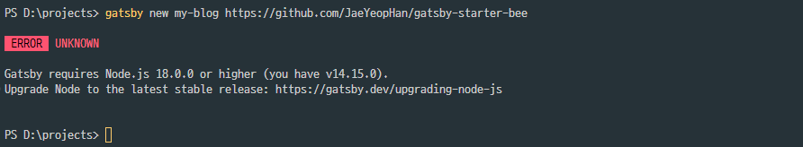
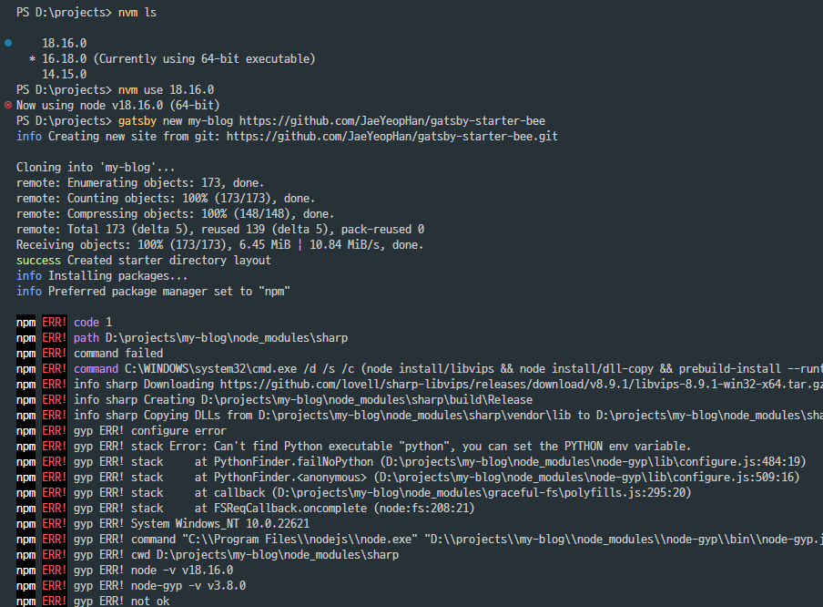
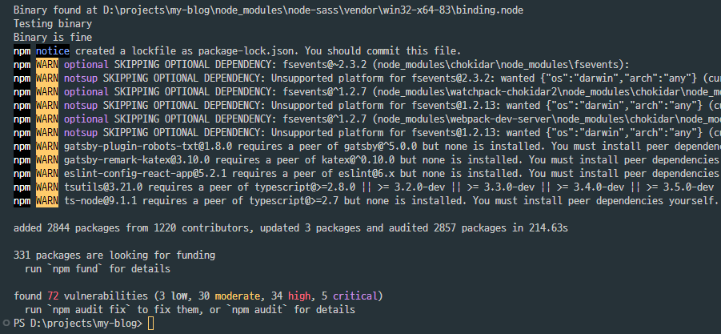
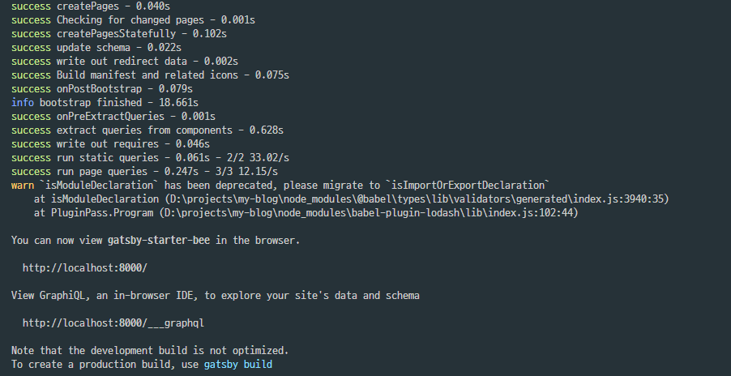
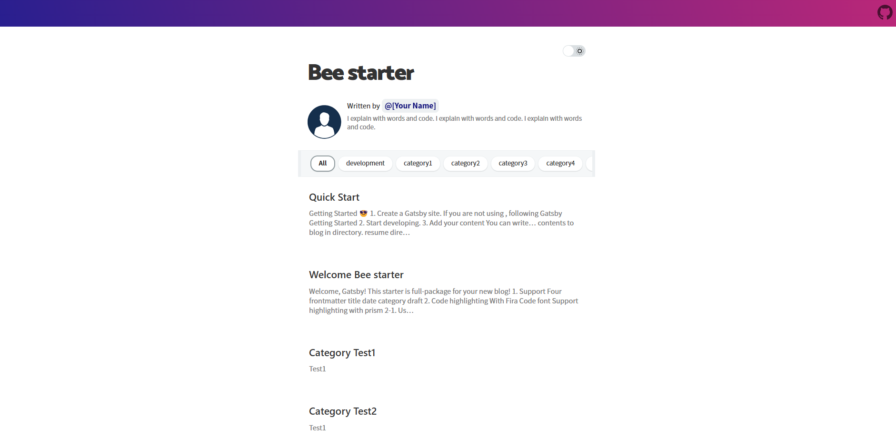

이 글은 gatsby + vercel를 사용하여 기술적인 과정을 직접 경험하면서 블로그를 개설하고자 하는 사람들을 위해서 작성되었습니다. 굳이 이렇게 하지 않더라도 티스토리, 벨로그, 미디움등 너무나 이쁘고 좋은 기능을 가진 블로그가 많으니 자신의 목적과 취향에 맞는 플랫폼을 선택하여 블로그를 개설하시는 것을 개인적으로는 추천합니다.
</br>
</br>

<strong>Prerequisites</strong>

- nvm 설치
- Vercel account
- AWS account(선택)
  </br>
  </br>

저는 다양한 버전의 node를 사용할 예정이므로 nvm을 미리 설치해야합니다. 앞으로 설치할 패키지에서 노드로 인한 디펜던시 오류가 발생할 수 있습니다. nvm를 설치함으로서 매우 편리하게 프로젝트에 필요한 노드 버전을 관리하고 사용할 수 있습니다.

프로젝트를 배포를 위해 저는 vercel을 사용합니다. 개인적으로 좋아하는 개발사이기도 하고 이전에 좋은 배포 경험을 제공해줘서 만족하고 사용하고 있습니다. Netlify, Github Page를 사용하여 웹사이트를 배포하셔도 무방합니다:)

AWS 계정은 route53을 통해 도메인을 구매하고 호스팅까지해서 나의 url를 연결하기위해 선택적으로 필요한 것이니 배포까지만 하고 싶은 사람은 계정이 없어도 됩니다.

</br>
</br>
</br>
</br>

## <strong>`Why Gatsby?`</strong><br/> ##

Gatsby는 React 기반의 정적 사이트 생성기로 많은 장점을 가지고 있습니다.
</br>

- Markdown 등의 마크업 언어를 사용하여 작성
- Progressive Web App(PWA)를 지원, SEO에도 우수
- 다양한 플러그인과 로더를 제공(이미지 최적화, 스타일링, 태그, 카테고리, 검색 등의 기능)
- 미리 생성된 HTML, CSS, JavaScript 파일을 사용하여 사이트를 렌더링(서버X, 빠른로딩, 보안우수)
</br>
</br>
</br>

[Gatsby Starters](https://www.gatsbyjs.com/starters/?v=2)는 Gatsby 커뮤니티에서 제공하는 템플릿을 모아둔 사이트입니다. Starter Kit, 블로그, 포트폴리오 등 다양한 종류의 템플릿을 찾아 사용할 수 있습니다. 아까 언급 했듯이, React 기반이라 원하는 템플릿을 가져와서 자신의 입맛대로 커스텀하여 사용할 수 있으니 프론트엔드 개발자의 입장에서는 얼마나 간편한가요. 참고로 저는 한재엽님(Jbee.io)이 만드신 Starter Kit을 이용해서 현재 블로그를 개설하였답니다. 앞으로 진행하는 설치 과정은 gatsby-starter-bee 템플릿을 기준으로 작성되었다는 점 참고하시길 바랍니다. 그럼 바로 만들어 볼까요?
</br>

```sh
# gatsby(Command Line Interface) 설치
$ npm install -g gatsby-cli

# my-project-name 원하는 프로젝트명을 작성, gatsby-starter-bee 템플릿을 클론
$ gatsby new my-project-name https://github.com/JaeYeopHan/gatsby-starter-bee
```
</br>
</br>

위의 명령어를 실행 후, 다음과 같은 에러가 발생할 수 있습니다.</br>
이는 설치 된 gatsby가 요구하는 node 버전과 현재 node 버전이 달라 발생하는 문제입니다.</br></br>

</br>
</br>

앞서 설치한 nvm을 명령어로 필요한 버전을 설치합니다.
</br>

```sh
# 설치된 node 버전 확인
$ nvm ls

# 최신 릴리즈버전(현재 v18.16.0) 설치
$ nvm install -lts

# v14.15.0 를 선택
$ nvm use 18.16.0
```
</br>
</br>

v18.~ 대의 노드를 설치하고 명령어를 수행하였음에도 다음과 같은 에러가 발생합니다. 패키지를 설치할 때 문제가 발생하고 있는 것을 확인할 수 있는데, 우리가 사용할 템플릿은 v14.15.0 버전에서 사용할 것을 권장하고 있습니다.</br></br>

</br>
</br>

필요한 버전을 설치한 후, 변경합니다.

```sh
# 최신 릴리즈버전(현재 v18.16.0) 설치
$ nvm install 14.15.0

# v14.15.0 를 선택
$ nvm use 14.15.0

# 템플릿 클론
$ gatsby new my-project-name https://github.com/JaeYeopHan/gatsby-starter-bee
```


</br>
</br>

프로젝트에 필요한 패키지를 재설치하면,

```sh
# 프로젝트 편집을 위해 디렉토리 이동
$ cd my-project-name/

# package-lock.json 삭제
$ rm -rf package-lock.json

# 의존 패키지 충돌 강제하여 설치
$ npm install --legacy-peer-deps
```


</br>
</br>

짜잔, 로컬 환경으로 접속하여 정상 동작되는 것을 확인할 수 있습니다. 이제 블로그를 입맛에 따라 커스텀하여 사용하시면 됩니다. @Jbee 님의 깃헙에 방문하시면 친절하게 기본 스타일 변경에 대해서 소개하니 세부사항에 대해서는 개인적으로 진행해주세요 :)

```sh
# 로컬 환경 실행(localhost:8000)
$ npm start
```



</br>
</br>
</br>
</br>

## <strong>`Deploy website`</strong><br/> ##
(작성중..)
</br>


</br>
</br>
</br>
</br>

## <strong>`Set my domain`</strong><br/> ##
(작성중..)
