이 글은 gatsby + vercel를 사용하여 기술적인 과정을 직접 경험하면서 블로그를 개설하고자 하는 사람들을 위해서 작성되었습니다. 굳이 이렇게 하지 않더라도 티스토리, 벨로그, 미디움등 너무나 이쁘고 좋은 기능을 가진 블로그가 많으니 자신의 목적과 취향에 맞는 플랫폼을 선택하여 블로그를 개설하시는 것을 개인적으로는 추천합니다.
</br>
</br>

<strong>Prerequisites</strong>

- nvm 설치
- Vercel account
- AWS account(선택)
  </br>
  </br>

저는 다양한 버전의 node를 사용할 예정이므로 nvm을 미리 설치해야합니다. 앞으로 설치할 패키지에서 노드로 인한 디펜던시 오류가 발생할 수 있습니다. nvm를 설치함으로서 매우 편리하게 프로젝트에 필요한 노드 버전을 관리하고 사용할 수 있습니다.

프로젝트를 배포를 위해 저는 vercel을 사용합니다. 개인적으로 좋아하는 개발사이기도 하고 이전에 좋은 배포 경험을 제공해줘서 만족하고 사용하고 있습니다. Netlify, Github Page를 사용하여 웹사이트를 배포하셔도 무방합니다:)

AWS 계정은 route53을 통해 도메인을 구매하고 호스팅까지해서 나의 url를 연결하기위해 선택적으로 필요한 것이니 배포까지만 하고 싶은 사람은 계정이 없어도 됩니다.

</br>
</br>
</br>
</br>

## <strong>`Why Gatsby?`</strong><br/>

Gatsby는 React 기반의 정적 사이트 생성기로 다음과 같은 특징을 가지고 있습니다.
</br>

- Markdown 등의 마크업 언어를 사용하여 작성
- Progressive Web App(PWA)를 지원, SEO에도 우수
- 다양한 플러그인과 로더를 제공(이미지 최적화, 스타일링, 태그, 카테고리, 검색 등의 기능)
- 미리 생성된 HTML, CSS, JavaScript 파일로 사이트를 렌더링(서버X, 빠른로딩, 보안우수)
  </br>
  </br>
  </br>

[Gatsby Starters](https://www.gatsbyjs.com/starters/?v=2)는 Gatsby 커뮤니티에서 제공하는 템플릿을 모아둔 사이트입니다. Starter Kit, 블로그, 포트폴리오 등 다양한 종류의 템플릿을 찾아 사용할 수 있습니다. 처음에 언급 했듯이, React 기반이라 원하는 템플릿을 가져와서 자신의 입맛대로 커스텀하여 사용할 수 있으니 프론트엔드 개발자의 입장에서는 정말 간편하겠죠? 참고로 저는 한재엽님(Jbee.io)이 만드신 Starter Kit을 이용해서 현재 블로그를 개설하였답니다. 제가 정말 좋아하는 개발자 중에 한명이세요. 프론트엔드 개발 뿐만아니라 프로그래밍적으로도 깊은 인사이트를 얻을 수 있으니 꼭 방문해보셔요. 더불어, 앞으로 진행하는 설치 과정은 gatsby-starter-bee 템플릿을 기준으로 작성되었다는 점 참고 부탁드려요 :> 그럼 바로 만들어 볼까요?
</br>

```sh
# gatsby(Command Line Interface) 설치
$ npm install -g gatsby-cli

# my-project-name 원하는 프로젝트명을 작성, gatsby-starter-bee 템플릿을 클론
$ gatsby new my-project-name https://github.com/JaeYeopHan/gatsby-starter-bee
```

</br>
</br>

위의 명령어를 실행한 후, 다음과 같은 에러가 발생할 수 있습니다.</br>
이는 설치 된 gatsby가 요구하는 node 버전과 현재 node 버전이 달라 발생하는 문제입니다.</br></br>

</br>
</br>

처음에 요구했던 nvm이 설치되어 있다면, 명령어로 필요한 노드 버전을 설치합니다. 여기서는 v18.0.0 이상의 버전을 요구하는데 2023년 4월 18일 날짜로 릴리즈 버전을 설치하시면 됩니다.
</br>

```sh
# 설치된 node 버전 확인
$ nvm ls

# 최신 릴리즈버전(현재 v18.16.0) 설치
$ nvm install -lts

# v14.15.0 를 선택
$ nvm use 18.16.0
```

</br>
</br>

18.~ 대의 노드를 설치하고 명령어를 수행하였음에도 다음과 같은 에러가 발생합니다. 정확히는 프로젝트를 클론 받고 패키지를 설치할 때 문제가 발생하고 있는 것을 확인할 수 있습니다. 이 문제를 해결하기 위해서 다시한번 nvm를 사용하여 v14.15.0 버전을 설치합니다. 현재 사용할 Gatsby 템플릿은 v14.15.0 버전에서 사용할 것을 권장하고 있습니다.</br></br>

</br>
</br>

필요한 버전을 설치한 후, 변경합니다.

```sh
# 최신 릴리즈버전(현재 v18.16.0) 설치
$ nvm install 14.15.0

# v14.15.0 를 선택
$ nvm use 14.15.0

# 템플릿 클론
$ gatsby new my-project-name https://github.com/JaeYeopHan/gatsby-starter-bee
```


</br>
</br>

프로젝트에 필요한 패키지를 재설치하면,

```sh
# 프로젝트 편집을 위해 디렉토리 이동
$ cd my-project-name/

# package-lock.json 삭제
$ rm -rf package-lock.json

# 의존 패키지 충돌 강제하여 설치
$ npm install --legacy-peer-deps
```


</br>
</br>

짜잔, 로컬 환경으로 접속하여 정상 동작되는 것을 확인할 수 있습니다. 이제 블로그를 입맛에 따라 커스텀하여 사용하시면 됩니다. @Jbee 님의 깃헙에 방문하시면 친절하게 기본 스타일 변경에 대해서 소개하니 세부사항에 대해서는 개인적으로 진행해주세요 :)

```sh
# 로컬 환경 실행(localhost:8000)
$ npm start
```


</br>
</br>
</br>
</br>

## <strong>`Deploy website`</strong><br/>

Vercel은 정적 웹 사이트 및 웹 애플리케이션을 빠르고 쉽게 배포하고 호스팅하는 클라우드 기반의 서비스로 다음과 같은 특징을 가지고 있습니다.
</br>

- 서버리스 아키텍쳐(서버 관리 신경X -> 개발 집중)
- 웹 애플리케이션 및 웹 사이트를 보호하기 위한 다양한 보안 기능(SSL제공)
- 사용자에게 빠른 페이지 로딩 속도와 좋은 사용자 경험을 제공(SSG지원)
- 글로벌 배포(전세계 분산 -> 빠른응답)
- 통합 데브옵스 도구(테스트, 모니터링 등)
  </br>
  </br>
  </br>

Vercel 외에도 다양한 대체 가능한 플랫폼들이 존재한답니다. Netlify, GitHub Pages, AWS Amplify Firebase Hosting등 다양한 정적 웹 사이트 배포 및 호스팅 서비스들 있습니다. 제가 Vercel을 선택한 이유는 이전 Next로 이미 경험을 가지고 있어 편의성, 개인적인 생산성에서 유리했기 때문입니다. 사실 기능적인 부분은 어느정도 평준화되어있기도하고 다른 서비스로의 대체 필요성을 느끼지 못했습니다. 프로젝트의 요구 사항, 개발 스택, 팀의 선호도 등을 고려하여 적절한 대체 플랫폼을 선택하는 것이 중요합니다.

</br>
</br>

각설하고, 블로그를 셋팅하고 첫 번째로 해야할 일은 프로젝트를 관리하고 Vercel에 배포하기 위해서 깃헙 레포지토리를 만들고 업로드하는 것입니다.
</br></br>
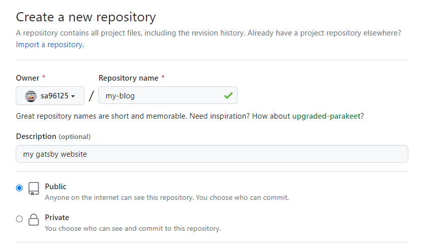

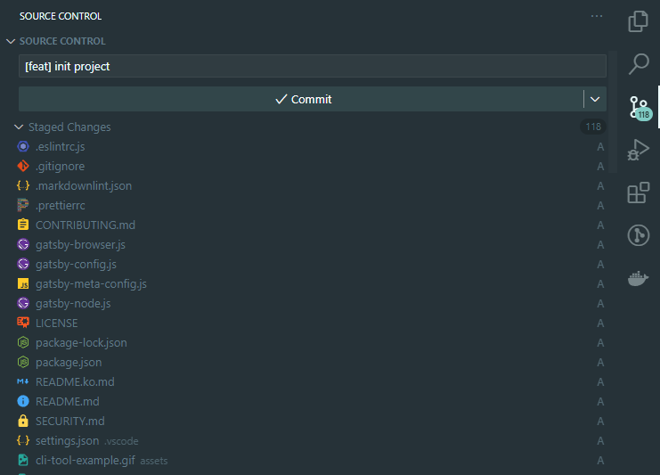

</br>
</br>
프로젝트를 잘 푸시하고, Vercel에 로그인합니다.
</br></br>

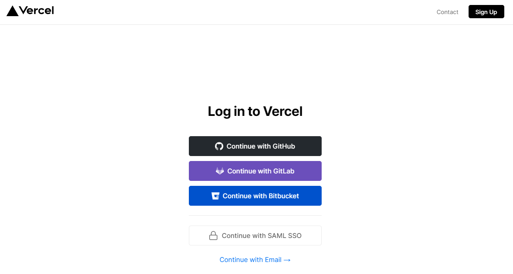

</br>
</br>
Add new > Project를 클릭합니다.
</br></br>

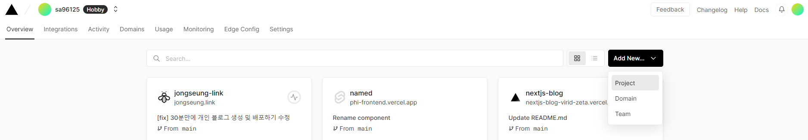

</br>
</br>
Import Git Repository에서 아까 만든 레포(my-blog)를 Import합니다.
</br></br>

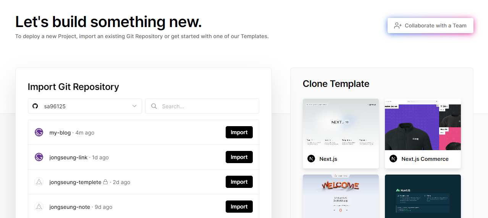

</br>
</br>
그리고 프로젝트에 배포에 대한 환경설정을 해야합니다. 로컬 프로젝트의 package.json에 작성한 script를 참고하여 명령어를 공유합니다. 저희 케이스에서는 패키지를 설치할 때 --legacy-peer-deps 옵션을 줘야하니 Install Command에 OVERRIDE 해줍시다 :)
</br></br>

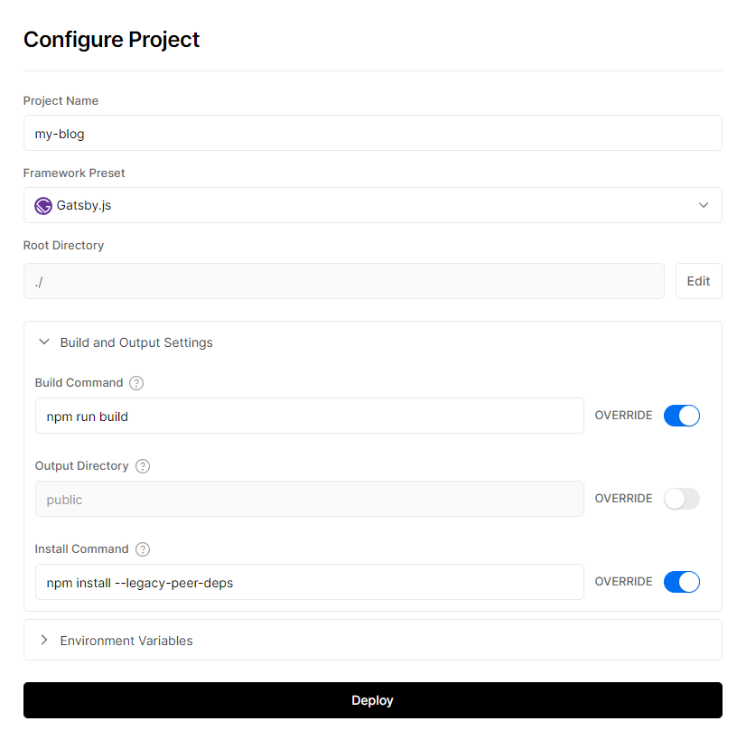


</br>
</br>
성공적으로 배포!.. 가 되면 좋겠지만, canceled와 함께 중단 될꺼에요. 로그를 보신분들은 눈치채셨겠지만, vercel의 기본 설정된 노드버전이 일치하지 않습니다.
</br></br>

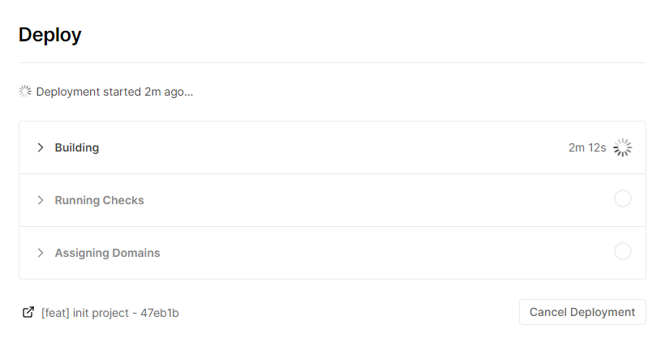

</br>
</br>
my-blog > Settings > General > Node.js Version 에서 기본 설정(1.8x)를 1.4x로 변경하고 저장한 후, Redeply를 실행합니다.
</br>
</br>

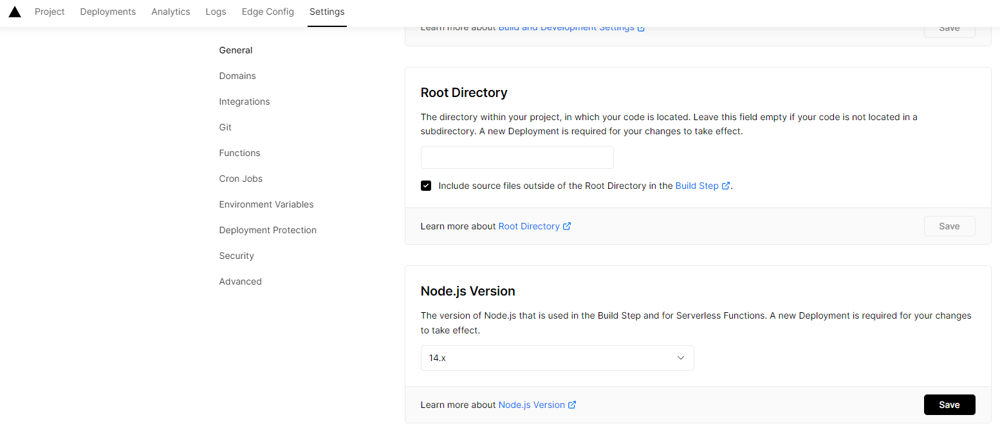

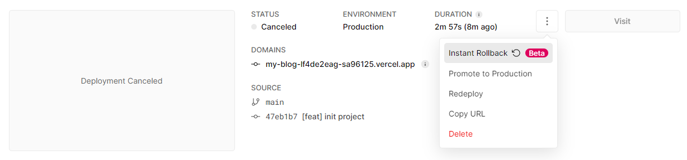

</br>
</br>
짜잔! 성공적으로 배포 완료되었습니다. 아래의 DOMAINS 주소로 외부에서 접속할 수 있습니다. 어때요 정말 간편하지 않나요? 과거에는 독립적으로 서버를 구축하고 관리해야했었습니다. 높은 비용과 기술적 지식이 요구되었지만 이제는 몇 번의 클릭으로 다양한 기능과 확장성을 사용할 수 있게 되었습니다.

</br>
</br>

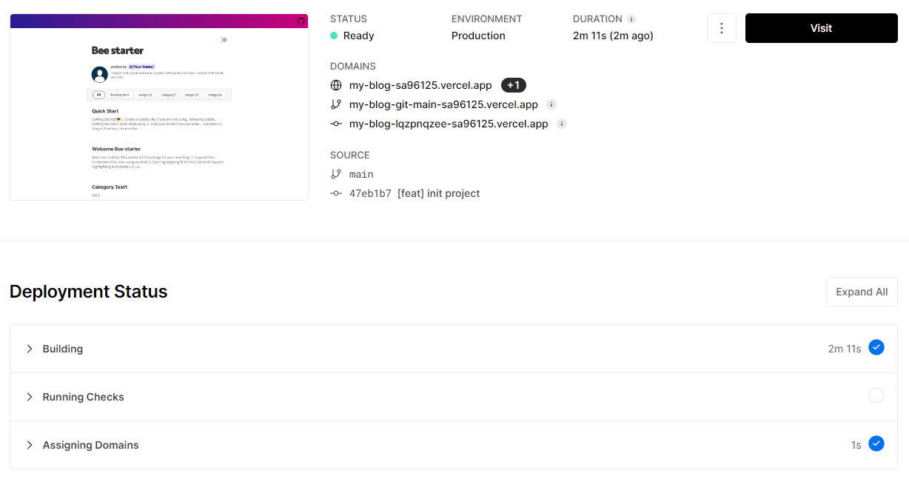


</br>
</br>
</br>
</br>

## <strong>`Set my domain`</strong><br/>

마지막으로, 배포된 웹사이트의 도메인주소를 변경해보도록하겠습니다. 참고로 이 과정은 도메인 등록 비용과 유지비용의 결제가 필요되니 필요에따라 진행해주시면 되겠숩니다 :) 설명하기에 앞서, 실제 청구되는 금액을 먼저 보여드리는게 선택하시기 수월할 것 같네요.

</br>
</br>

첨부된 사진에서 비용 및 사용량을 보시고 놀랄 수도 있는데, 저 같은 경우 프리티어 기간이 끝났고 요즘 아키텍쳐 설계에 대해 공부하고 있어 이것저것 시도하다 보니 비용이 저렇게 나온거구요. 도메인 호스팅에 대한 비용 즉 도메인 유지비용은 Amazon route 53 US $1.00이 청구 되었습니다. 이는 월별 청구 비용으로 큰 금액은 아니지만, 혹시 모르는 청구 금액이 걱정되신다면 [이 글](https://jw910911.tistory.com/92)을 참고 해주세요.
</br>

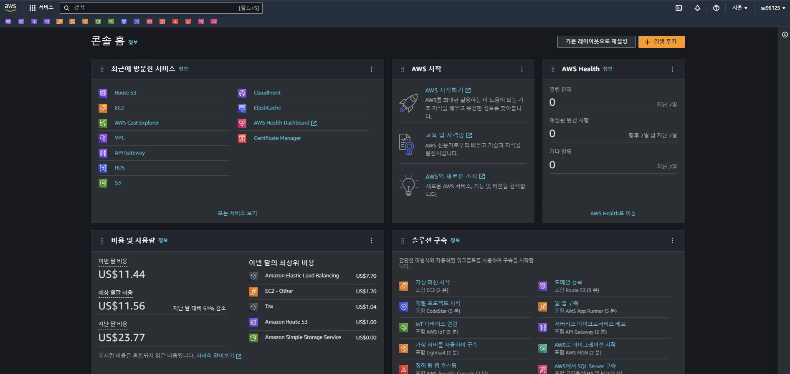

</br>
</br>

다음은 도메인 등록에 대한 비용인데, 이는 국가 및 지역에 따라 다를 수 있어요. 따라서 어떤 곳이 저렴하다고는 말씀드릴 수 없습니다. ;( 비용에 상관없이 자신의 프로젝트에 어울리는 url명을 구입하는게 서비스를 이용하는 사람들에게 기억되기가 쉬울테니 충분히 고민해보고 결정하시라 말씀드리고 싶네요. 저 같은 경우는 5달러짜리로 구매했고 아마존 도메인 등록서비스에서 가장 싼건 3달러 짜리도 있네요. 

</br>
</br>

그럼 함께 도메인을 등록 해봅시다. 서비스에서 route53을 검색하고 클릭합니다.
</br>

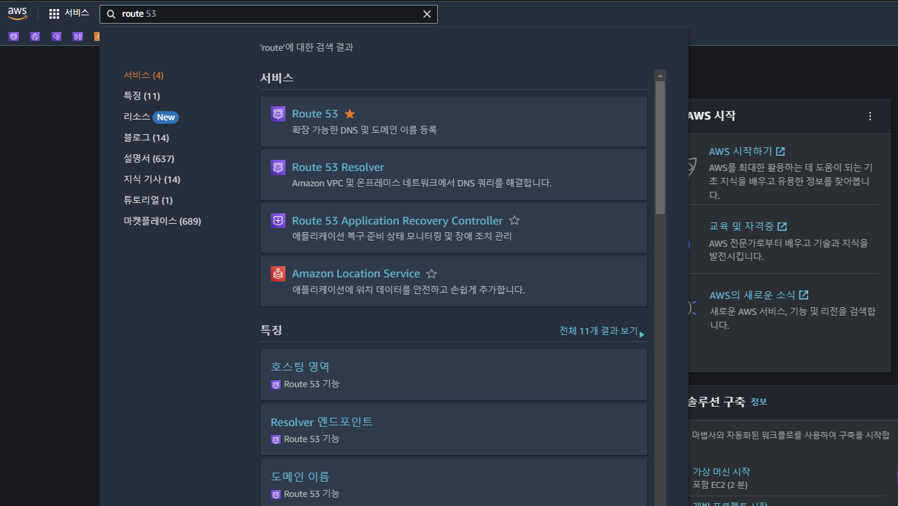


</br>
</br>

대시보드를 보면 제일 오른쪽에 도메인 등록이 있죠? 저는 이미 등록한 상황이라 1이지만 처음 등록하시는 분은 0일꺼에요. 밑에 파란색 <도메인> 버튼을 눌러주세요.
</br>

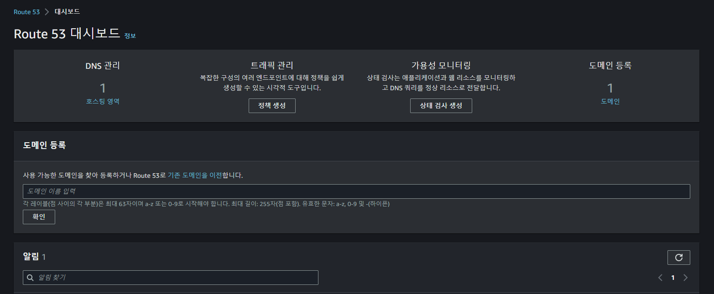


</br>
</br>

클릭, <도메인 등록> 버튼
</br>

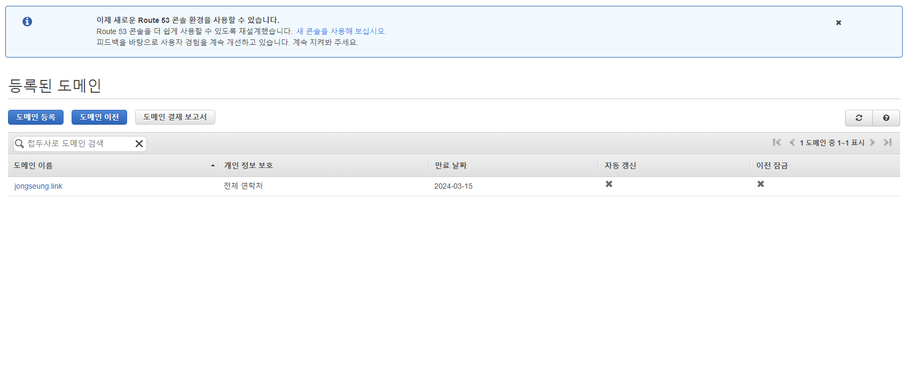


</br>
</br>

이곳에 자신이 사용할 도메인을 사용할 수 있는지 없는지 확인할 수 있고 사용 가능하다면 확인 > 세부정보 등록 > 확인 및 구매 절차를 진행하시면 됩니다. 이때, 환경에 따라 시간이 좀 걸릴 수 있습니다. 저같은 경우는 10분만에 나왔던 것 같아요. 대기 중인 요청에서 사라지면 사용할 수 있습니다 :)
</br>

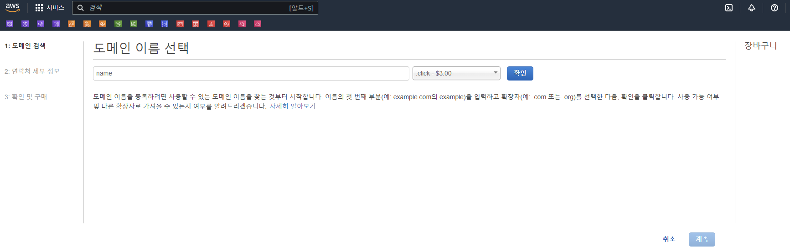

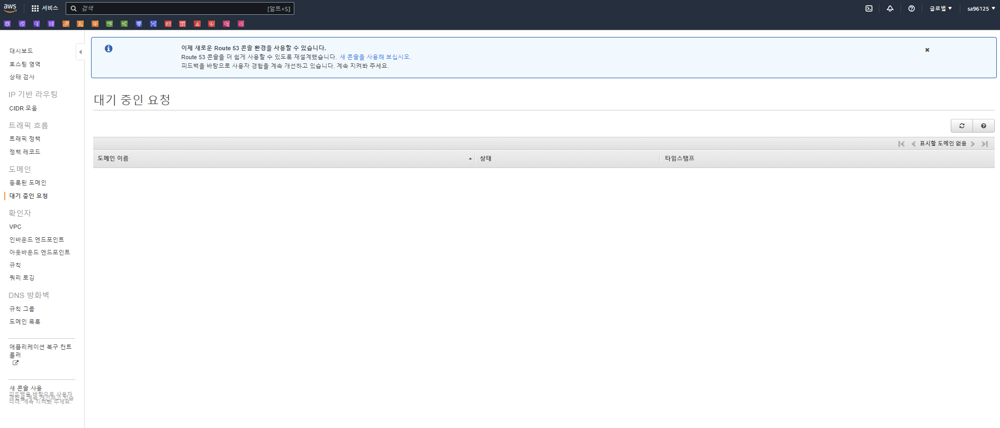


</br>
</br>

성공적으로 도메인이 등록되었다면, 도메인과 프로젝트를 연결하기 위해 배포 서비스(vercel)의 셋팅을 변경해주도록 합시다. Project > View Domains에서 아까 등록한 도메인 주소를 입력하고 < Add > 버튼을 누릅니다.
</br>

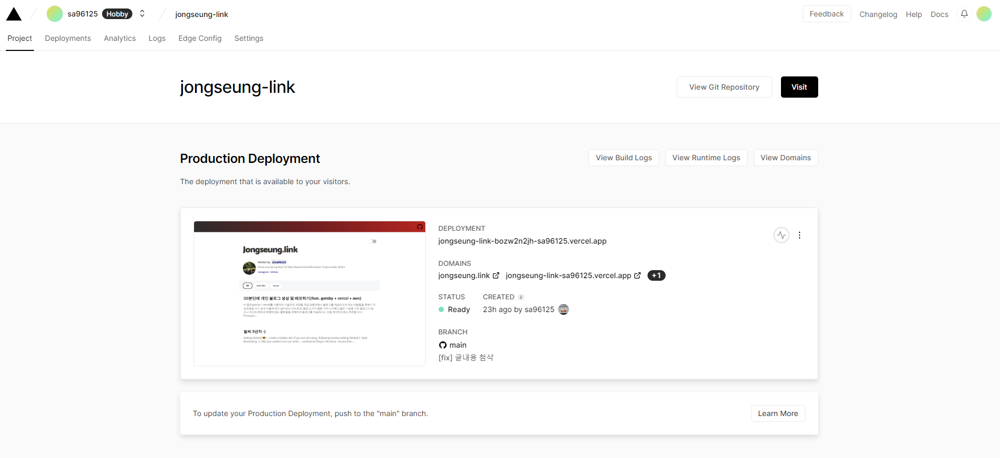

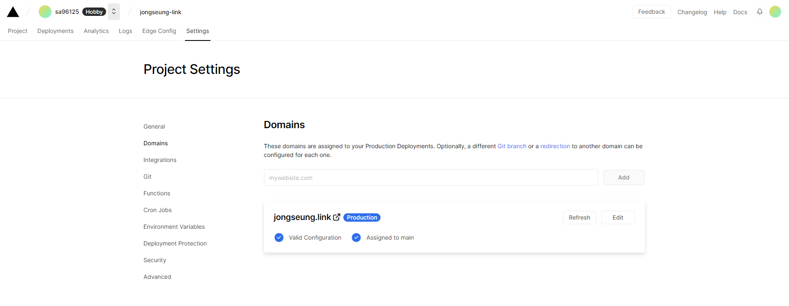


</br>
</br>

www. 로 접속해도 도메인으로 리다이렉트하게 하고싶다면 변경없이 진행합니다. 
이대로 도메인을 추가하고 나면, DNS record를 확인할 수 있는데 Value에 해당하는 주소만 복사해주도록 합시다.
</br>

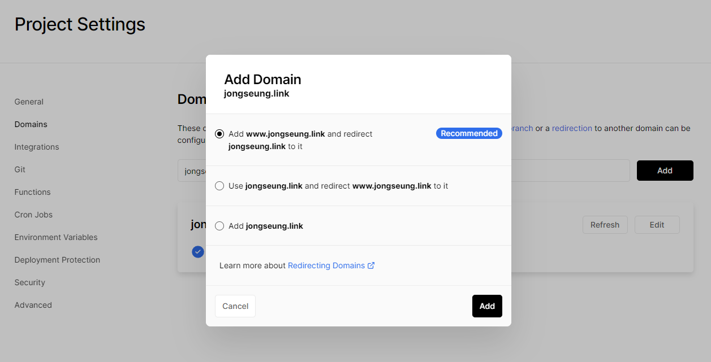

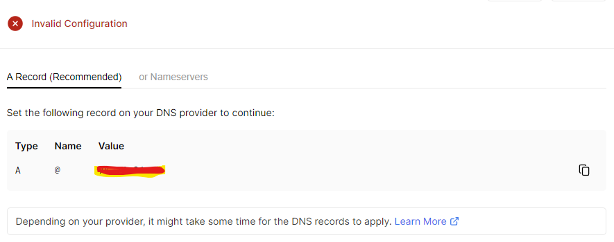


</br>
</br>

이제 거의 마무리 단계입니다. 빠르게 진행해보겠습니다. 다시 한번 Route 53 대시보드에 접속하여, 제일 왼쪽 DNS 관리의 < 호스팅 영역 > 버튼 클릭 후, < 호스팅 영역 생성 > 버튼 클릭하고 자신의 도메인 주소(예, jongseung.link)를 입력합니다.
</br>


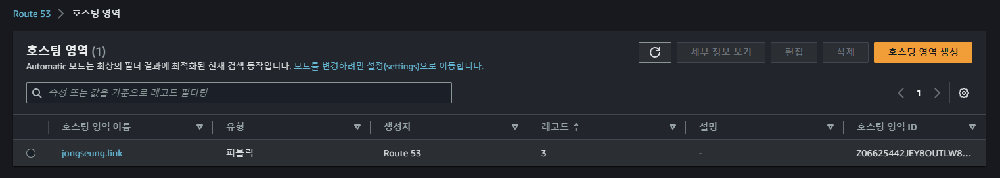

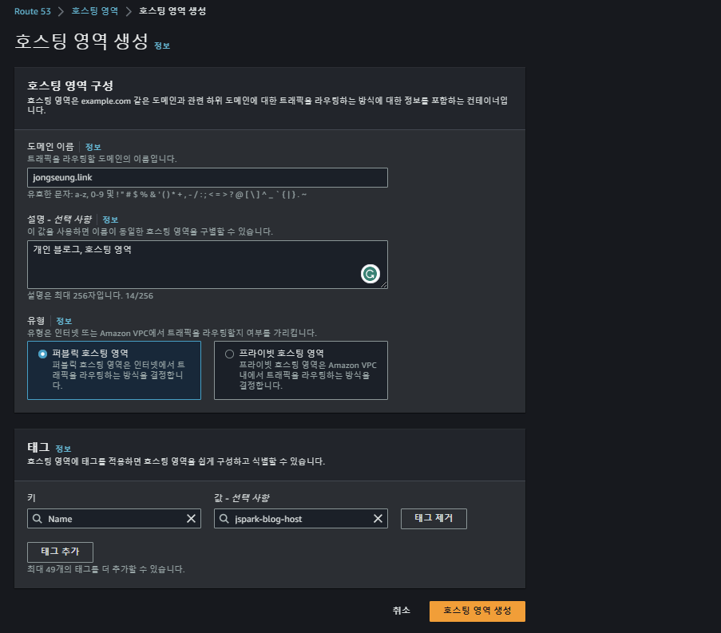


</br>
</br>

생성 후, 호스팅 영역 세부 정보를 확인합니다. 저는 이미 셋팅을 해서 3개지만, 레코드가 2개가 기본으로 등록되어 있을거에요. < 레코드 생성 > 버튼을 눌러 아까 Vercel에서 복사한 레코드 값을 붙여넣기하고 레코드 생성을 마무리합니다.
</br>

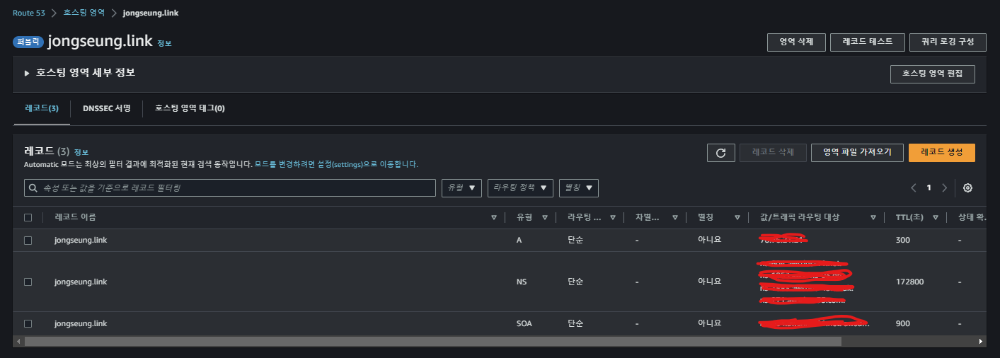

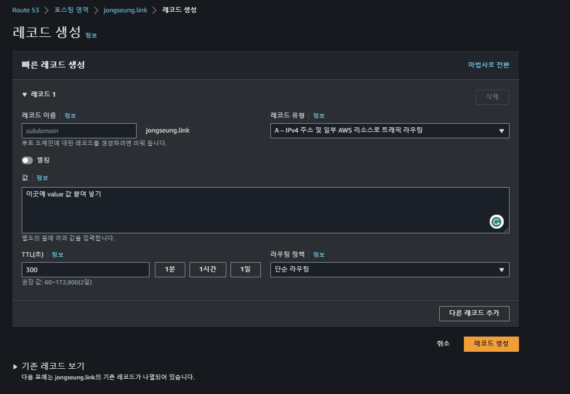

</br>
</br>

축하합니다! aws의 서비스를 통해 성공적으로 vercel과 연결하였습니다. 이 과정에서도 약간의 시간이 소요될 수 있으니 조금 기다리시면 문제 없으실 거에요 :>
</br>

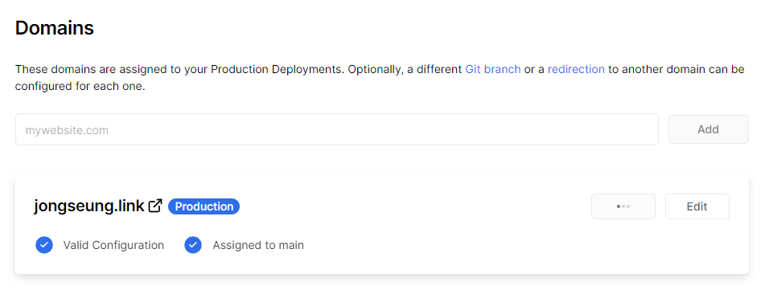


</br>
</br>
</br>
</br>


고생하셨습니다. 첫 포스팅을 뭘 하면 좋을까? 고민하다 나와 같은 시도를 하고자하는 사람에게 도움을 주고 싶어서 좀 무리하게 전체 과정을 담아봤습니다. 사실 vercel + aws를 사용했다곤 하지만 따라해보신분은 느끼겠지만, 심도 있는 내용은 없습니다 ㅎㅎ. 다만, 전체적인 플로우를 경험했을 때, 정말 큰 이점을 가진다고 생각합니다.

작업이 각 단계에서 어떻게 이어지는지 이해하면, 앞으로 각 단계의 요구 사항을 잘 파악할 수도 있고 이런 지식이 차곡차곡 쌓여 작업에 참여하는 다양한 팀이나 개인 간의 협력, 생산성이 높아집니다. 얼마나 깊이, 전문성을 갖출 것인가는 다음 스텝, 개인 역량에 맡기면 될거 같아요.

그 동안 저도 블로그 플랫폼을 사용하다가 이렇게 개인적인 웹사이트를 가지게 되니 뭔가 더 애착이 생기네요. 좋은 템플릿을 만들어주신 한재엽님에게도 감사의 인사를 전하고 싶고 앞으로 좋은 글을 많이 담아봐야겠습니다. 읽어주셔서 감사합니다.
